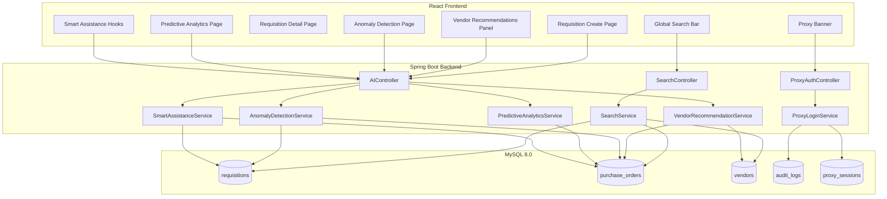
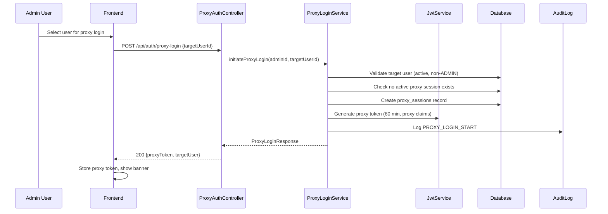
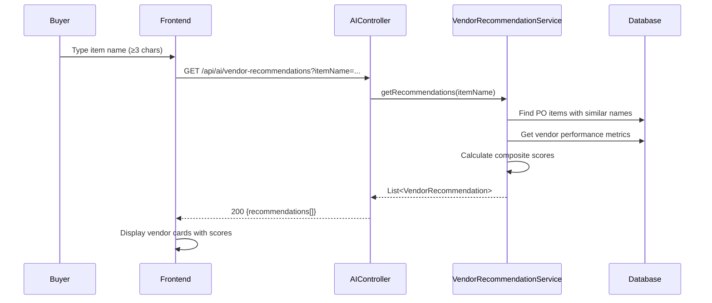

# Design Document: SmartProcure AI

## Overview

This design covers eight major enhancements to the SmartProcure procurement platform:

1. **Requisition Creation Page Redesign** — A modern multi-section form with stepper navigation, sticky summary panel, inline validation, auto-save to localStorage, and responsive breakpoints.
2. **Requisition Detail Page Redesign** — An information-rich detail view with workflow progress tracker, approval timeline, sortable line items table, and print layout.
3. **Global Search Bar** — A cross-entity search component in the header with debounced dropdown, keyboard navigation, and role-based result filtering.
4. **Proxy Login (Admin Impersonation)** — Enables ADMIN users to impersonate other users with a time-limited session, audit trail, and visual proxy mode banner.
5. **AI Vendor Recommendations** — Suggests optimal vendors for requisition items based on historical pricing, delivery performance, and quality ratings.
6. **AI Anomaly Detection** — Detects price anomalies, split ordering patterns, and vendor concentration risks in procurement data.
7. **AI Predictive Analytics** — Provides spend forecasts and demand predictions with confidence intervals using historical trend analysis.
8. **AI Smart Requisition Assistance** — Offers item name autocomplete and price suggestions from historical procurement data.

### Key Design Decisions

| Decision | Choice | Rationale |
|----------|--------|-----------|
| AI Engine | Rule-based analysis (no external LLM) | Matches existing SpendAnalysisService pattern; deterministic, testable, no external API cost |
| Search implementation | Database LIKE queries with UNION | Simple, uses existing JPA infrastructure, sufficient for expected data volumes |
| Proxy token strategy | Separate JWT with proxy claims | Allows independent expiry (60 min), preserves admin identity in claims for audit |
| Frontend state management | React Hook Form + Zod for forms, TanStack Query for server state | Already in project dependencies |
| Auto-save | localStorage with 30s debounce | No backend changes needed; graceful degradation on quota errors |
| Anomaly detection | Statistical analysis (standard deviation, threshold checks) | Predictable, explainable results; no ML model training required |

## Architecture

### High-Level Architecture



### Request Flow — Proxy Login



### Request Flow — AI Vendor Recommendation



## Components and Interfaces

### Backend Components

#### 1. SearchController

```java
@RestController
@RequestMapping("/api/search")
public class SearchController {
    
    @GetMapping
    @PreAuthorize("isAuthenticated()")
    public ResponseEntity<SearchResponse> search(
        @RequestParam @Size(min = 2, max = 100) String q,
        @AuthenticationPrincipal UserPrincipal currentUser);
}
```

#### 2. ProxyAuthController

```java
@RestController
@RequestMapping("/api/auth")
public class ProxyAuthController {

    @PostMapping("/proxy-login")
    @PreAuthorize("hasRole('ADMIN')")
    public ResponseEntity<ProxyLoginResponse> proxyLogin(
        @Valid @RequestBody ProxyLoginRequest request,
        @AuthenticationPrincipal UserPrincipal admin);

    @PostMapping("/proxy-logout")
    @PreAuthorize("isAuthenticated()")
    public ResponseEntity<Void> endProxySession(
        @AuthenticationPrincipal UserPrincipal currentUser);
}
```

#### 3. AIController (extends existing AI endpoints)

```java
@RestController
@RequestMapping("/api/ai")
public class AIController {

    @GetMapping("/vendor-recommendations")
    @PreAuthorize("hasAnyRole('BUYER', 'ADMIN')")
    public ResponseEntity<List<VendorRecommendationResponse>> getVendorRecommendations(
        @RequestParam @Size(min = 3) String itemName);

    @GetMapping("/anomalies")
    @PreAuthorize("hasRole('ADMIN')")
    public ResponseEntity<List<AnomalyResponse>> getAnomalies();

    @GetMapping("/predictions/spend-forecast")
    @PreAuthorize("hasAnyRole('ADMIN', 'BUYER')")
    public ResponseEntity<SpendForecastResponse> getSpendForecast();

    @GetMapping("/predictions/demand")
    @PreAuthorize("hasAnyRole('ADMIN', 'BUYER')")
    public ResponseEntity<DemandForecastResponse> getDemandForecast();

    @GetMapping("/item-suggestions")
    @PreAuthorize("hasAnyRole('BUYER', 'ADMIN')")
    public ResponseEntity<List<String>> getItemSuggestions(
        @RequestParam String prefix);

    @GetMapping("/price-suggestion")
    @PreAuthorize("hasAnyRole('BUYER', 'ADMIN')")
    public ResponseEntity<PriceSuggestionResponse> getPriceSuggestion(
        @RequestParam String itemName);
}
```

#### 4. Service Interfaces

```java
public interface SearchService {
    SearchResponse search(String query, UserPrincipal currentUser);
}

public interface ProxyLoginService {
    ProxyLoginResponse initiateProxyLogin(Long adminId, Long targetUserId);
    void endProxySession(Long userId);
    boolean isProxySession(String token);
}

public interface VendorRecommendationService {
    List<VendorRecommendationResponse> getRecommendations(String itemName);
}

public interface AnomalyDetectionService {
    List<AnomalyResponse> detectAnomalies();
}

public interface PredictiveAnalyticsService {
    SpendForecastResponse getSpendForecast();
    DemandForecastResponse getDemandForecast();
}

public interface SmartAssistanceService {
    List<String> getItemSuggestions(String prefix);
    PriceSuggestionResponse getPriceSuggestion(String itemName);
}
```

### Frontend Components

#### 1. GlobalSearchBar Component

```
src/components/GlobalSearchBar.jsx
- Props: none (uses AuthContext internally)
- State: query, results, isOpen, selectedIndex
- Hooks: useDebounce(300ms), useQuery (TanStack), useHotkeys (Ctrl+K)
- Behavior: debounced search, keyboard navigation, grouped results dropdown
```

#### 2. Requisition Form (Redesigned)

```
src/pages/requisitions/CreateRequisition.jsx (rewrite)
- Sub-components:
  - RequisitionStepper.jsx (Header → Items → Review)
  - RequisitionHeader.jsx (department, cost center, description)
  - LineItemsSection.jsx (dynamic item rows with animations)
  - RequisitionSummary.jsx (sticky panel - totals, item count)
  - VendorRecommendationPanel.jsx (AI vendor suggestions)
- Form library: react-hook-form + zod validation
- Auto-save: localStorage with 30s interval
```

#### 3. Requisition Detail (Redesigned)

```
src/pages/requisitions/RequisitionDetail.jsx (rewrite)
- Sub-components:
  - WorkflowTracker.jsx (horizontal progress with stages)
  - ApprovalTimeline.jsx (vertical timeline)
  - LineItemsTable.jsx (sortable columns, alternating rows)
  - RequisitionMetadata.jsx (department, cost center grid)
  - PrintLayout.jsx (print-optimized view)
```

#### 4. AI Pages

```
src/pages/ai/AnomalyDetection.jsx
src/pages/ai/PredictiveAnalytics.jsx
```

#### 5. Proxy Login Components

```
src/components/ProxyBanner.jsx (fixed top banner)
- Integration in AuthContext for proxy session state
```

### API Layer Extensions

```javascript
// src/api/aiApi.js (extended)
export const aiApi = {
  getSpendAnalysis: () => api.get('/ai/spend-analysis'),
  getVendorRecommendations: (itemName) => api.get('/ai/vendor-recommendations', { params: { itemName } }),
  getAnomalies: () => api.get('/ai/anomalies'),
  getSpendForecast: () => api.get('/ai/predictions/spend-forecast'),
  getDemandForecast: () => api.get('/ai/predictions/demand'),
  getItemSuggestions: (prefix) => api.get('/ai/item-suggestions', { params: { prefix } }),
  getPriceSuggestion: (itemName) => api.get('/ai/price-suggestion', { params: { itemName } }),
}

// src/api/searchApi.js (new)
export const searchApi = {
  search: (q) => api.get('/search', { params: { q } }),
}

// src/api/authApi.js (extended)
export const authApi = {
  // ... existing
  proxyLogin: (targetUserId) => api.post('/auth/proxy-login', { targetUserId }),
  proxyLogout: () => api.post('/auth/proxy-logout'),
}
```

## Data Models

### New Database Table: proxy_sessions

```sql
CREATE TABLE IF NOT EXISTS proxy_sessions (
    id              BIGINT AUTO_INCREMENT PRIMARY KEY,
    admin_id        BIGINT NOT NULL,
    target_user_id  BIGINT NOT NULL,
    token           VARCHAR(500) NOT NULL,
    started_at      DATETIME NOT NULL DEFAULT CURRENT_TIMESTAMP,
    expires_at      DATETIME NOT NULL,
    ended_at        DATETIME,
    status          ENUM('ACTIVE','EXPIRED','ENDED') NOT NULL DEFAULT 'ACTIVE',
    CONSTRAINT fk_ps_admin FOREIGN KEY (admin_id) REFERENCES users(id),
    CONSTRAINT fk_ps_target FOREIGN KEY (target_user_id) REFERENCES users(id)
);
```

### New Entity: ProxySession

```java
@Entity
@Table(name = "proxy_sessions")
public class ProxySession {
    @Id @GeneratedValue(strategy = GenerationType.IDENTITY)
    private Long id;
    
    @ManyToOne(fetch = FetchType.LAZY)
    @JoinColumn(name = "admin_id", nullable = false)
    private User admin;
    
    @ManyToOne(fetch = FetchType.LAZY)
    @JoinColumn(name = "target_user_id", nullable = false)
    private User targetUser;
    
    private String token;
    private LocalDateTime startedAt;
    private LocalDateTime expiresAt;
    private LocalDateTime endedAt;
    
    @Enumerated(EnumType.STRING)
    private ProxySessionStatus status;
    
    public enum ProxySessionStatus { ACTIVE, EXPIRED, ENDED }
}
```

### Updated AuditLog Entity

Add new audit actions to the existing `AuditAction` enum:

```java
public enum AuditAction {
    // existing...
    LOGIN, USER_CREATED, USER_UPDATED, USER_ACTIVATED,
    USER_DEACTIVATED, VENDOR_CREATED, VENDOR_UPDATED,
    VENDOR_DEACTIVATED, REQUISITION_CREATED, REQUISITION_SUBMITTED,
    REQUISITION_APPROVED, REQUISITION_REJECTED,
    PO_CREATED, PO_UPDATED, PO_CANCELLED,
    // new actions for proxy login
    PROXY_LOGIN_START, PROXY_LOGIN_END, PROXY_LOGIN_EXPIRED,
    PROXY_LOGIN_DENIED
}
```

### DTO Models

#### SearchResponse

```java
public record SearchResponse(
    List<SearchResult> requisitions,
    List<SearchResult> purchaseOrders,
    List<SearchResult> vendors,
    List<SearchResult> items
) {}

public record SearchResult(
    Long id,
    String title,
    String subtitle,
    String entityType
) {}
```

#### ProxyLoginRequest / Response

```java
public record ProxyLoginRequest(@NotNull Long targetUserId) {}

public record ProxyLoginResponse(
    String proxyToken,
    String tokenType,
    Long targetUserId,
    String targetEmail,
    String targetFirstName,
    String targetLastName,
    Set<String> targetRoles,
    LocalDateTime expiresAt
) {}
```

#### VendorRecommendationResponse

```java
public record VendorRecommendationResponse(
    Long vendorId,
    String vendorName,
    String vendorCode,
    int confidenceScore,        // 0-100
    BigDecimal averagePrice,
    int deliveryPerformance,    // 0-100 percentage
    BigDecimal rating,
    String reasoning
) {}
```

#### AnomalyResponse

```java
public record AnomalyResponse(
    Long id,
    String type,                // PRICE, SPLIT_ORDER, VENDOR_CONCENTRATION
    String severity,            // LOW, MEDIUM, HIGH
    String description,
    List<AffectedEntity> affectedEntities,
    String recommendedAction,
    LocalDateTime detectedAt
) {}

public record AffectedEntity(
    String entityType,
    Long entityId,
    String entityName
) {}
```

#### SpendForecastResponse

```java
public record SpendForecastResponse(
    List<MonthlyForecast> forecasts,
    List<HistoricalDataPoint> historicalData
) {}

public record MonthlyForecast(
    String month,               // "2025-07"
    BigDecimal predictedSpend,
    BigDecimal lowerBound,      // 80% confidence
    BigDecimal upperBound,
    boolean lowConfidence
) {}

public record HistoricalDataPoint(
    String month,
    BigDecimal actualSpend,
    int orderCount
) {}
```

#### DemandForecastResponse

```java
public record DemandForecastResponse(
    List<CategoryDemandForecast> categories
) {}

public record CategoryDemandForecast(
    String categoryName,
    List<MonthlyDemand> forecasts,
    List<MonthlyDemand> historical,
    boolean insufficientData
) {}

public record MonthlyDemand(
    String month,
    int predictedQuantity,
    BigDecimal predictedSpend,
    BigDecimal lowerBound,
    BigDecimal upperBound
) {}
```

#### PriceSuggestionResponse

```java
public record PriceSuggestionResponse(
    String itemName,
    BigDecimal suggestedPrice,
    BigDecimal minPrice,
    BigDecimal maxPrice,
    int dataPointCount,
    boolean insufficientData
) {}
```

### Repository Extensions

```java
// PurchaseOrderItemRepository (new or extended)
public interface PurchaseOrderItemRepository extends JpaRepository<PurchaseOrderItem, Long> {
    
    @Query("SELECT poi FROM PurchaseOrderItem poi WHERE LOWER(poi.itemName) LIKE LOWER(CONCAT('%', :name, '%'))")
    List<PurchaseOrderItem> findByItemNameContainingIgnoreCase(@Param("name") String name);
    
    @Query("SELECT DISTINCT poi.itemName FROM PurchaseOrderItem poi WHERE LOWER(poi.itemName) LIKE LOWER(CONCAT(:prefix, '%')) ORDER BY poi.itemName")
    List<String> findItemNamesByPrefix(@Param("prefix") String prefix, Pageable pageable);
    
    @Query("SELECT poi FROM PurchaseOrderItem poi WHERE LOWER(poi.itemName) = LOWER(:name) ORDER BY poi.purchaseOrder.orderDate DESC")
    List<PurchaseOrderItem> findByItemNameIgnoreCase(@Param("name") String name, Pageable pageable);
}

// RequisitionItemRepository (new or extended)
public interface RequisitionItemRepository extends JpaRepository<RequisitionItem, Long> {
    
    @Query("SELECT DISTINCT ri.itemName FROM RequisitionItem ri WHERE LOWER(ri.itemName) LIKE LOWER(CONCAT(:prefix, '%')) ORDER BY ri.itemName")
    List<String> findItemNamesByPrefix(@Param("prefix") String prefix, Pageable pageable);
}

// ProxySessionRepository (new)
public interface ProxySessionRepository extends JpaRepository<ProxySession, Long> {
    Optional<ProxySession> findByAdminIdAndStatus(Long adminId, ProxySessionStatus status);
    Optional<ProxySession> findByTokenAndStatus(String token, ProxySessionStatus status);
    List<ProxySession> findByStatusAndExpiresAtBefore(ProxySessionStatus status, LocalDateTime now);
}
```


## Correctness Properties

*A property is a characteristic or behavior that should hold true across all valid executions of a system — essentially, a formal statement about what the system should do. Properties serve as the bridge between human-readable specifications and machine-verifiable correctness guarantees.*

### Property 1: Line Total Calculation Invariant

*For any* set of line items where each item has a quantity (positive integer) and a unit price (positive decimal), the displayed line total for each item SHALL equal quantity × unitPrice, and the overall requisition total SHALL equal the sum of all line totals.

**Validates: Requirements 1.7**

### Property 2: Auto-Save Round Trip

*For any* valid requisition form state (header fields + line items), serializing the form data to localStorage and then deserializing it SHALL produce an equivalent form state with all field values preserved.

**Validates: Requirements 1.10**

### Property 3: Workflow Tracker Stage Correctness

*For any* requisition with a given status, the workflow tracker SHALL mark all lifecycle stages preceding the current status as completed (filled with success color), highlight the current stage as active, and leave subsequent stages unmarked.

**Validates: Requirements 2.2**

### Property 4: Line Items Table Sort Correctness

*For any* list of requisition line items and any sortable column (item name, quantity, unit price, line total), sorting by that column SHALL produce items in correct ascending or descending order according to the column's data type, and the footer total SHALL always equal the sum of all line totals regardless of sort order.

**Validates: Requirements 2.4**

### Property 5: Search Substring Matching

*For any* search query string and any entity in the database, the search service SHALL return the entity in results if and only if the query appears as a case-insensitive contiguous substring within at least one searchable field of that entity.

**Validates: Requirements 3.3**

### Property 6: Search Results Per-Category Limit

*For any* search query that matches more than 5 entities in any single category (Requisitions, Purchase Orders, Items, Vendors), the dropdown SHALL display at most 5 results for that category with a "View all" link.

**Validates: Requirements 3.7**

### Property 7: Search Role-Based Result Filtering

*For any* authenticated user with a given role and any search query, all returned search results SHALL be entities that the user's role is authorized to access — no result SHALL belong to an entity type that the user's role cannot view.

**Validates: Requirements 3.9**

### Property 8: Search Query Length Validation

*For any* query string shorter than 2 characters or longer than 100 characters submitted to the search endpoint, the service SHALL return a validation error without performing a search.

**Validates: Requirements 3.13**

### Property 9: Proxy Token Scoped to Target Permissions

*For any* valid ADMIN user and any valid target user (active, non-ADMIN), initiating a proxy login SHALL produce a token that grants exactly the target user's role-based permissions and no additional permissions.

**Validates: Requirements 4.2**

### Property 10: Proxy Audit Dual-Identity

*For any* action performed during an active proxy session, the audit log entry SHALL contain both the original ADMIN user's identity and the impersonated user's identity.

**Validates: Requirements 4.4**

### Property 11: Proxy Session End Restores Admin

*For any* active proxy session, ending the session SHALL invalidate the proxy token and restore the ADMIN's original session with their original permissions.

**Validates: Requirements 4.5**

### Property 12: Invalid Proxy Login Rejection

*For any* proxy login attempt where the caller is not an ADMIN, or the target user does not exist, has the ADMIN role, or is inactive/disabled, the system SHALL reject the request with an appropriate error and log the attempt.

**Validates: Requirements 4.6, 4.9**

### Property 13: Vendor Recommendation Score Invariant

*For any* set of vendor performance data (historical pricing, delivery timeliness, quality ratings), each computed composite score SHALL be an integer between 0 and 100 inclusive, and the returned recommendations SHALL be sorted in descending order by score.

**Validates: Requirements 5.2**

### Property 14: Price Anomaly Detection

*For any* requisition line item where the item category has at least 5 historical data points, if the unit price exceeds 2 standard deviations above the historical mean for that category, the system SHALL flag it as a price anomaly. Conversely, if the price is within 2 standard deviations, it SHALL NOT be flagged.

**Validates: Requirements 6.1, 6.2**

### Property 15: Split Ordering Detection

*For any* requester who creates 3 or more requisitions within a 7-day window where each individual requisition total is below the approval threshold and the combined total of those requisitions exceeds the threshold, the system SHALL detect and flag a split ordering anomaly.

**Validates: Requirements 6.3**

### Property 16: Vendor Concentration Detection

*For any* item category over a rolling 90-day window, if a single vendor accounts for more than 60 percent of total spend within that category, the system SHALL flag a vendor concentration anomaly.

**Validates: Requirements 6.4**

### Property 17: Anomaly Severity Classification

*For any* detected anomaly with a known financial impact amount and statistical deviation, the system SHALL assign severity HIGH when impact exceeds 10,000 or deviation exceeds 4σ, MEDIUM when impact is between 2,000 and 10,000 or deviation is between 2σ and 4σ, and LOW for all other anomalies.

**Validates: Requirements 6.7**

### Property 18: Minimum Data Points Guard for Anomalies

*For any* item category with fewer than 5 historical data points, the anomaly detection engine SHALL skip analysis and SHALL NOT produce any anomaly flags for that category.

**Validates: Requirements 6.8**

### Property 19: Spend Forecast Confidence Interval Validity

*For any* spend forecast produced by the predictive analytics engine, the response SHALL contain exactly 6 monthly entries where for each entry: lower_bound ≤ predicted_spend ≤ upper_bound, representing an 80% confidence interval.

**Validates: Requirements 7.1**

### Property 20: Low-Confidence Forecast Flagging

*For any* forecast category where the rolling 3-month forecast accuracy (predicted vs actual) is below 70%, the forecast SHALL be flagged as lowConfidence in the response.

**Validates: Requirements 7.5**

### Property 21: Insufficient History Guard for Forecasts

*For any* category with fewer than 3 months of historical data, the predictive analytics engine SHALL omit the forecast for that category and return an insufficientData indication.

**Validates: Requirements 7.6**

### Property 22: Role-Based Endpoint Access Control

*For any* user without the required role attempting to access a protected AI endpoint (anomalies requires ADMIN; predictions require ADMIN or BUYER), the system SHALL return HTTP 403 Forbidden.

**Validates: Requirements 6.9, 7.7**

### Property 23: Item Suggestion Prefix Matching

*For any* prefix string of 2 or more characters, all returned item suggestions SHALL begin with that prefix (case-insensitive), the result set SHALL contain at most 10 items, and no valid matching item from history SHALL be excluded if the result set has fewer than 10 entries.

**Validates: Requirements 8.1, 8.3**

### Property 24: Price Suggestion Correctness

*For any* item name with 3 or more historical purchase records, the suggested unit price SHALL equal the median of up to the last 10 purchases, the minPrice SHALL be the minimum and maxPrice the maximum of those records, the suggestedPrice SHALL fall within [minPrice, maxPrice], and the dataPointCount SHALL reflect the actual number of records used. For items with fewer than 3 records, the response SHALL indicate insufficientData with no suggested price.

**Validates: Requirements 8.2, 8.4, 8.5**

### Property 25: Empty Result for Short Prefix

*For any* prefix string shorter than 2 characters submitted to the item suggestions endpoint, the service SHALL return an empty list without performing any database search.

**Validates: Requirements 8.7**

## Error Handling

### Backend Error Handling Strategy

The application uses a `GlobalExceptionHandler` (@ControllerAdvice) pattern. New error cases fit within this existing approach:

| Error Scenario | HTTP Status | Response Body |
|----------------|-------------|---------------|
| Search query < 2 or > 100 chars | 400 Bad Request | `{"message": "Query must be between 2 and 100 characters"}` |
| Proxy login by non-ADMIN | 403 Forbidden | `{"message": "Access denied"}` |
| Proxy login target invalid (nonexistent/ADMIN/inactive) | 400 Bad Request | `{"message": "Target user is not available for proxy login"}` |
| Nested proxy session attempt | 409 Conflict | `{"message": "Nested proxy sessions are not permitted"}` |
| AI service internal error | 500 Internal Server Error | `{"message": "AI service temporarily unavailable"}` |
| Vendor recommendations no matches | 200 OK | `{"recommendations": []}` |
| Insufficient data for predictions | 200 OK | Response with `insufficientData: true` per category |
| Proxy session expired | Token validation fails → 401 | Frontend detects and restores admin session |

### Frontend Error Handling Strategy

| Error Scenario | UI Behavior |
|----------------|-------------|
| Search API timeout (>5s) | Show "Search temporarily unavailable" with retry button |
| Search API error (5xx) | Show inline error message in dropdown |
| AI recommendation service error | Show non-blocking toast: "AI suggestions temporarily unavailable" |
| Auto-save localStorage quota exceeded | Show warning banner: "Auto-save unavailable — storage quota reached" |
| Proxy session expired (60 min) | Show notification "Proxy session expired", auto-restore admin session |
| Proxy login failed | Show toast with error message from backend |
| Predictions insufficient data | Show message in chart area: "Not enough data for this category" |

### Graceful Degradation Principles

1. **AI features are optional** — If any AI endpoint fails, the user can continue all manual workflows without interruption.
2. **Search failures don't block navigation** — The search dropdown shows an error but the app remains fully functional.
3. **Proxy session expiry is non-destructive** — The admin's original session is always recoverable from localStorage backup.
4. **Auto-save failure is non-blocking** — A warning appears but form submission still works normally.

## Testing Strategy

### Property-Based Testing

This feature is suitable for property-based testing due to multiple algorithmic components (scoring, anomaly detection, statistical calculations, search matching) that have well-defined universal properties over varied inputs.

**Library**: [fast-check](https://github.com/dubzzz/fast-check) for JavaScript/TypeScript frontend tests, and JUnit + [jqwik](https://jqwik.net/) for Java backend tests.

**Configuration**:
- Minimum 100 iterations per property test
- Each property test references its design property number
- Tag format: `Feature: smartprocure-ai, Property {N}: {property_text}`

### Backend Test Strategy

| Component | Test Type | Tools |
|-----------|-----------|-------|
| VendorRecommendationService | Property tests (score invariant, ordering) | jqwik |
| AnomalyDetectionService | Property tests (threshold detection, severity classification) | jqwik |
| PredictiveAnalyticsService | Property tests (interval validity, guards) | jqwik |
| SmartAssistanceService | Property tests (prefix matching, median calculation) | jqwik |
| SearchService | Property tests (substring matching, role filtering) | jqwik |
| ProxyLoginService | Property tests (token scoping, rejection) + unit tests | jqwik + JUnit 5 |
| Controllers | Integration tests (endpoint contracts, auth) | @SpringBootTest + MockMvc |

### Frontend Test Strategy

| Component | Test Type | Tools |
|-----------|-----------|-------|
| Line total calculations | Property tests | fast-check + Vitest |
| Auto-save serialization | Property tests (round-trip) | fast-check + Vitest |
| Workflow tracker logic | Property tests (stage mapping) | fast-check + Vitest |
| Sort logic | Property tests | fast-check + Vitest |
| CreateRequisition page | Example-based (form interactions, validation) | Vitest + Testing Library |
| RequisitionDetail page | Example-based (rendering, conditionals) | Vitest + Testing Library |
| GlobalSearchBar | Example-based (keyboard nav, debounce) | Vitest + Testing Library |
| ProxyBanner | Example-based (visibility, end session) | Vitest + Testing Library |
| AI pages (Anomaly, Predictions) | Example-based (data rendering) | Vitest + Testing Library |

### Unit Tests (Example-Based)

Focus unit tests on:
- **Specific UI rendering scenarios** (stepper states, banner visibility, empty states)
- **Edge cases** (50 item limit, localStorage quota error, expired sessions)
- **Integration points** (API response handling, auth context state changes)
- **Error states** (network failures, timeout handling, invalid responses)

### Integration Tests

- **End-to-end flows**: proxy login → perform action → verify dual audit log → end session
- **Search across entities**: verify correct SQL joins and role-based filtering
- **AI data pipeline**: insert test POs → call anomaly detection → verify correct flags
- **Concurrency**: Two admins attempting proxy login for the same target simultaneously
